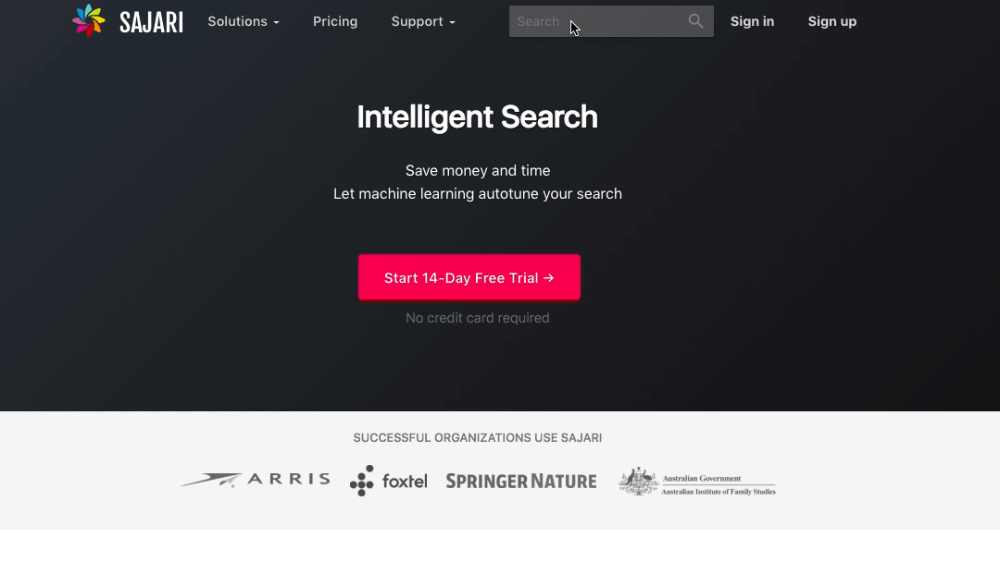

# Sajari React SDK

[](https://www.npmjs.com/package/@sajari/sdk-react)
[](https://travis-ci.org/sajari/sajari-sdk-react)
[](./LICENSE)

`@sajari/sdk-react` is a client side javascript library of React Components for the
[Sajari](https://www.sajari.com) search platform to help build fast and powerful search interfaces.

React provides a simple and elegant way to structure user interfaces. The Sajari React SDK provides
a way to seamlessly integrate the Sajari platform into any web-based app through the use of easily
composable Components.

We also provide a vanilla Sajari JS library [here](https://github.com/sajari/sajari-sdk-js/).

[](https://www.sajari.com)

# Table of contents

- [Examples](#examples)
- [Installation](#installation)
- [Documentation](#documentation)
- [License](#license)
- [Browser support](#browser-support)

# Examples

It's easy to get up and running using one of our examples as a starting point.
They're pre-configured with all the correct dependencies, so all you need to do is copy the example
directory into your own workspace and you're on your way!

- **Basic**: basic search box, hit enter to search (<a href="https://3vy8p6k7z1.codesandbox.io/" target="_blank">View</a>, <a href="https://codesandbox.io/s/3vy8p6k7z1" target="_blank">Edit</a>).
- **Typeahead with Instant Search**: search box with typeahead autocomplete and instant search enabled (<a href="https://5zz60m4l0p.codesandbox.io/" target="_blank">View</a>, <a href="https://codesandbox.io/s/5zz60m4l0p" target="_blank">Edit</a>).
- **Suggestions Dropdown**: search box with drop-down autocomplete suggestions (<a href="https://pvo0pxojx.codesandbox.io/" target="_blank">View</a>, <a href="https://codesandbox.io/s/pvo0pxojx" target="_blank">Edit</a>).
- **Radio/checkbox**: radio/checkbox filtering (<a href="https://w64pm94vn8.codesandbox.io/" target="_blank">View</a>, <a href="https://codesandbox.io/s/w64pm94vn8" target="_blank">Edit</a>).
- **Radio/checkbox Facets**: radio/checkbox filtering and facets (<a href="https://isqwn.csb.app/" target="_blank">View</a>, <a href="https://codesandbox.io/s/sajari-react-sdk-example-radio-checkbox-facets-isqwn" target="_blank">Edit</a>).
- **Custom Result Renderer**: custom result renderer (<a href="https://6x0vwormkk.codesandbox.io/" target="_blank">View</a>, <a href="https://codesandbox.io/s/6x0vwormkk" target="_blank">Edit</a>)

<!-- TODO(@benhinchley): build examples in codesandbox

* [Sliding autocomplete dropdown](./examples/sliding-autocomplete-dropdown): search box enabled by clicking search icon.
* [Standard search](./examples/standard-search/): instant search with autocomplete + tab filtering.
* [Aggregate](./examples/aggregate/): aggregate filtering.

-->

# Installation

This module is distributed via [npm](https://www.npmjs.com/) which is bundled with
[node](https://nodejs.org/en/) and should be installed as one of your project's `dependencies`:

We distribute the `@sajari/sdk-react` library through NPM.

```shell
$ npm install --save @sajari/sdk-react
```

> This package also depends on [`react`](https://www.npmjs.com/package/react). Please make sure you have those installed as well.

## Quick setup

See the [quick setup](https://sajari-sdk-react.netlify.app/quick-setup) guide to setup a basic search.

# Documentation

For documentation, see [sajari-sdk-react.netlify.app](https://sajari-sdk-react.netlify.app/).

# License

We use the [MIT license](./LICENSE)

# Browser support

The browser support is dependent on the React library, which currently supports recent versions of Chrome, Firefox, Sajari, Opera, and IE9+. (17/8/2016)
